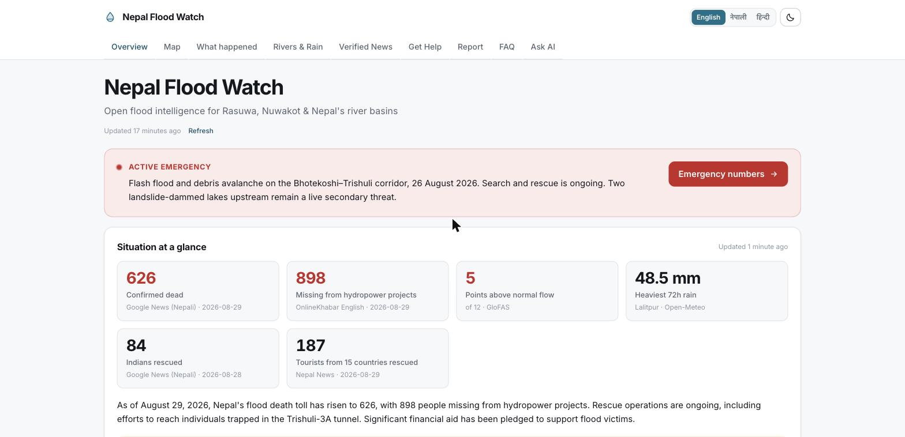
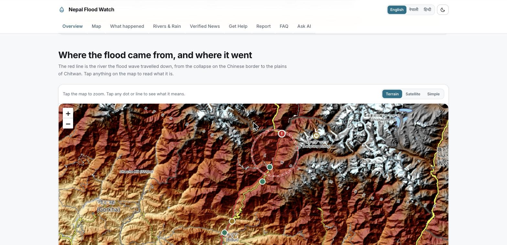
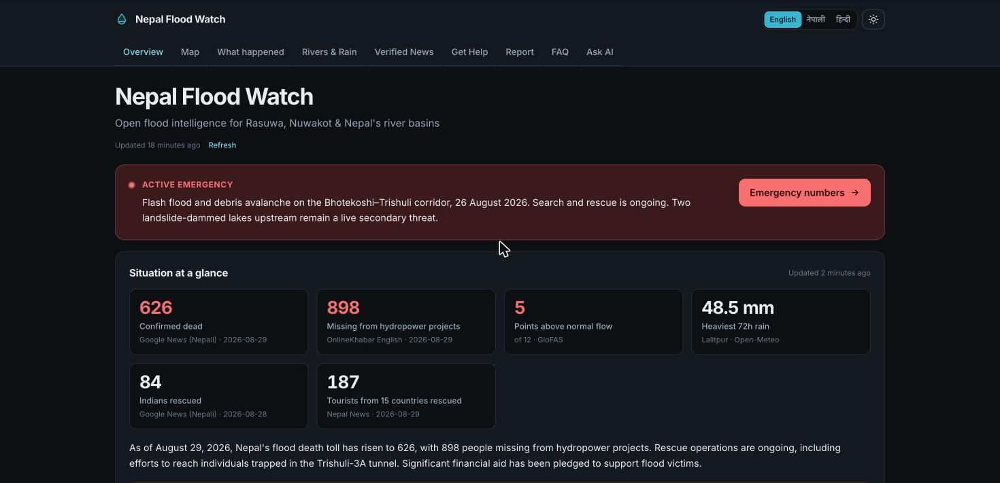

# Nepal Flood Watch

**Open flood intelligence for Nepal, built during the Bhotekoshi–Trishuli disaster of 26 August 2026.**

Live river levels, cross-checked news, verified emergency numbers and a public help board — free, no login, no paywall, in **English, नेपाली and हिन्दी**, light and dark.

> Independent public-interest project. Not a government service. In an emergency call **1149** (National Emergency Operation Centre) or **100** (Nepal Police).



---

## What it does

| Section | What it gives people |
| --- | --- |
| **Overview** | Casualty and rescue figures extracted from live headlines — each shown with the outlet that reported it and the date. Nothing is hard-coded. |
| **Map** | Terrain, satellite or plain view of the valley with the 177 km flood path drawn on real river geometry, the collapse point, the dammed-lake advisory zone and every monitoring point. |
| **What happened** | A step-by-step schematic of the river from the glacier collapse down to Chitwan, with real distances along the channel. Uses no map conventions at all. |
| **Rivers & Rain** | Modelled discharge and rainfall for 12 points, a 13-day trace splitting record from forecast, and an AI risk outlook written from those numbers. |
| **Verified News** | Eight Nepali, international and humanitarian feeds, deduplicated and scored by how many *independent* outlets carry the same story. Plus an AI digest and a web-searching fact-checker. |
| **Get Help** | Nepal's national emergency short codes as tap-to-call cards, safety steps, relief organisations. |
| **Report** | An open board for needs, missing persons, hazard sightings and offers of help. Every submission is AI-screened for abuse and third-party personal data before it appears. |
| **FAQ / Ask AI** | Hand-written answers to what people are actually searching, plus Q&A grounded in the live data on the page. |

### The flood path, on real terrain

The red line is the actual river course from OpenStreetMap — not a sketch. Terrain is the default view because the story here is topographic: a wall of water funnelled down a steep Himalayan gorge.



### Dark mode



---

## Design decisions worth knowing

**Risk is relative, not official.** Nepal's DHM publishes the official danger levels and this project does not restate or invent them. The "vs normal" figure is the forecast 7-day peak divided by that point's own median flow over the previous 45 days — a scale-free anomaly derived entirely from the data.

**Coarse model cells are flagged, not hidden.** GloFAS runs on ~5 km cells, so some headwater points (Timure, Dhunche) sit on a side tributary rather than the main stem. Those absolute discharges are marked `†` and dimmed, and the model is instructed never to quote them. Snapping them to a bigger nearby cell was tried and rejected: it silently relocated points onto entirely different rivers.

**Numbers carry their source, and their scope.** No casualty figure is hard-coded. Any figure the model returns without an attributable outlet is dropped before render. Labels must preserve the qualifier from the headline — "898 missing **from hydropower projects**" never becomes "898 missing", because presenting a subset as a total is the worst error this page could make.

**The dam-lake zone is an advisory circle, not a pin.** The two landslide-dammed lakes are real and dangerous, but their positions are not publicly surveyed. A precise marker would imply precision nobody has.

**Nepali gets a hand-written locale fallback.** Chrome ships no CLDR data for `ne` — `Intl.RelativeTimeFormat("ne")` silently resolves to `en-US`. The app detects that at runtime and supplies Nepali dates and relative times itself.

**The AI layer degrades, it never blocks.** Station counts, rainfall and feed health are computed without a model. If every LLM provider is down or rate-limited, those still render and the page simply notes the AI summary is unavailable.

---

## Architecture

```
src/
├── app/
│   ├── [[...locale]]/       # /, /ne, /hi — each statically prerendered
│   ├── api/                 # hydro, news, hazards, situation, analysis,
│   │                        # digest, factcheck, ask, reports
│   ├── opengraph-image.tsx  # generated social card
│   ├── robots.ts  sitemap.ts
├── components/              # UI, all client-side
├── data/
│   ├── stations.ts          # 12 monitoring points
│   └── floodpath.ts         # 177 km river geometry (4 KB, baked in)
└── lib/
    ├── llm.ts               # two-provider OpenAI-compatible client
    ├── hydro.ts news.ts hazards.ts
    ├── db.ts                # Turso / libSQL / memory
    ├── i18n.ts seo.ts helplines.ts format.ts
```

### LLM setup

Two OpenAI-compatible providers, tried in order. Both speak the same wire format, so failover is a base-URL swap rather than a second client.

| Role | Model | Why |
| --- | --- | --- |
| Primary | `google/gemini-2.5-flash-lite` | ~$0.09 per 1,000 calls, strong Devanagari |
| Fact-check | `perplexity/sonar` | Needs live web search — a claim circulating today can't be checked against training data |
| Fallback | Groq `gpt-oss-120b` / `compound` | Free tier, used when the primary is missing, 429s or 5xxs |

> **On picking the model by measurement:** `gpt-5-nano` looked 5× cheaper per token. On a representative extraction prompt it spent **6,655 output tokens** where Flash Lite spent **199** — reasoning models bill hidden thinking — making it ~30× dearer in practice. It also invented a figure ("tunnel drill count: 3" from a headline about *Trishuli-3A*) on a prompt that explicitly forbids inventing figures. Sticker price would have chosen wrong.

### Data sources

All free and key-free except the LLM providers.

- [Open-Meteo Flood API](https://open-meteo.com/en/docs/flood-api) — Copernicus GloFAS river discharge
- [Open-Meteo Weather API](https://open-meteo.com/) — ECMWF & GFS rainfall
- [GDACS](https://www.gdacs.org/) — EU/UN disaster alerts · [USGS](https://earthquake.usgs.gov/fdsnws/event/1/) — seismic events
- [ReliefWeb](https://reliefweb.int/country/npl) — humanitarian reports
- Kathmandu Post, OnlineKhabar, Setopati, Khabarhub, Rising Nepal, Nepal News, Google News
- [OpenStreetMap](https://www.openstreetmap.org/copyright) — base tiles, river geometry · [OpenTopoMap](https://opentopomap.org/) — terrain · Esri — imagery

---

## Running locally

```bash
git clone https://github.com/AIAnytime/nepal-flood-watch.git
cd nepal-flood-watch
npm install
cp .env.example .env     # add LLM_API_KEY (and/or GROQ_API_KEY)
npm run dev
```

The site works with no keys at all — river, rainfall, hazard and news data all render. The AI features and report screening need a provider.

### Deploying

Deploy to Vercel and set the same variables in project settings. Set `NEXT_PUBLIC_SITE_URL` to your real domain or the sitemap, canonical tags and hreflang will point at the placeholder.

Add the Turso pair if you want public reports to survive a redeploy — without it, a deployed instance keeps them in memory only.

---

## Caveats

Modelled river discharge is not a gauge reading. AI summaries can be wrong. Casualty figures are provisional and change daily. This is not a government service — in an emergency, call **1149** or **100** and follow official instructions.

---

Built by **AI Anytime** ❤️ · [YouTube](https://www.youtube.com/@AIAnytime) · [GitHub](https://github.com/AIAnytime)
